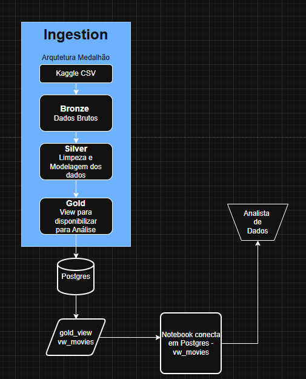

# Pipeline ETL - Movies

## Visão Geral

- **Objetivo:** Pipeline ETL simples que ingere um CSV de filmes (bronze), aplica transformações (silver) e expõe uma view de negócio (gold).
- **Arquitetura Medalhão:** arquivos SQL em `bronze/`, `silver/`, `gold/`; script de ingestão em `ingestion/script.py`; notebook em `notebooks/movies-notebook.ipynb`.

## Visão de Produção

Em um cenário de produção, o container do Jupyter seria exposto aos Analistas de Dados via VPS com um Proxy Reverso (Nginx) e certificado SSL. O acesso é autenticado via senha criptografada (configurada no docker-compose), isolando o banco de dados PostgreSQL na rede interna do Docker e da Empresa.

## Fluxo



## Estrutura importante

- [docker/docker-compose.yaml](docker/docker-compose.yaml)
- [docker/Dockerfile](docker/Dockerfile)
- [docker/requirements.txt](docker/requirements.txt)
- [ingestion/script.py](ingestion/script.py)
- [notebooks/movies-notebook.ipynb](notebooks/movies-notebook.ipynb)
- [data/movies_dataset.csv](data/movies_dataset.csv)
- [bronze/movies-csv/CREATE_TABLE_BRONZE_MOVIES.sql](bronze/movies-csv/CREATE_TABLE_BRONZE_MOVIES.sql)
- [silver/movies/CREATE_TABLE_SILVER_MOVIES.sql](silver/movies/CREATE_TABLE_SILVER_MOVIES.sql)
- [gold/movies/CREATE_VIEW_GOLD_MOVIES.sql](gold/movies/CREATE_VIEW_GOLD_MOVIES.sql)

## Pré-requisitos

- Docker & Docker Compose (para executar serviço Postgres + Jupyter).
- Python 3.9+ (para execução local do script de ingestão, opcional).
- Se executar local sem Docker: criar um ambiente virtual e instalar dependências (veja seção abaixo).

## Variáveis de ambiente

O projeto usa variáveis de ambiente para conexão ao Postgres. A raiz já contém um `.env` referenciado pelo `docker-compose`. Não comite credenciais reais.

Exemplo (coloque em `.env` na raiz — este é apenas um exemplo com placeholders):

```powershell
DB_USER=seu_usuario
DB_PASSWORD=sua_senha
DB_NAME=movies_db
DB_HOST=localhost
DB_PORT=5432
```

Observações:
- O serviço `db` no [docker/docker-compose.yaml](docker/docker-compose.yaml) usa `env_file: ../.env`.
- O serviço Jupyter usa `docker/.env.notebook` (copiado para o container pelo `Dockerfile`).

## Instalar dependências (local, opcional)

Crie e ative um venv e instale as dependências listadas para o ambiente Jupyter (o arquivo está em `docker/requirements.txt`):

```powershell
python -m venv .venv
.\.venv\Scripts\Activate.ps1
pip install -r docker/requirements.txt
```

Se preferir criar um `requirements.txt` no root, recomendo fixar versões a partir do ambiente atual.

**Executar com Docker Compose (recomendado)**

1. Vá para a pasta `docker`:

```powershell
cd docker
```

2. Suba os serviços (Postgres + Jupyter):

```powershell
docker compose -f docker-compose.yaml up --build
```

3. Acesse o Jupyter em `http://localhost:8888` (o `docker-compose` do projeto inicia o notebook sem token no ambiente de desenvolvimento). O notebook está mapeado da pasta `notebooks`.

## Executar localmente (sem Docker)

1. Ative o `venv` e instale dependências (ver seção acima).
2. Verifique que o Postgres está acessível (local ou remoto) usando as variáveis em `.env`.
3. Execute o script de ingestão:

```powershell
python ingestion/script.py
```

O script realiza os passos principais:
- (opcional) download do dataset (o repositório já contém `data/movies_dataset.csv`);
- cria schemas/tabelas via os SQLs em `bronze/`, `silver/` e `gold/` (conforme `ingestion/script.py`);
- injeta os dados em `bronze.movies`, aplica transformações e popula `silver.movies` e a view `gold.vw_movies`.

## Acessar o banco e verificar tabelas

Exemplo com `psql` (substitua placeholders):

```powershell
psql -h localhost -p 5432 -U <DB_USER> -d <DB_NAME>
-- Dentro do psql:
\dt bronze.*
SELECT count(*) FROM bronze.movies;
SELECT count(*) FROM silver.movies;
SELECT * FROM gold.vw_movies LIMIT 10;
```

## Notebook

O notebook principal é [notebooks/movies-notebook.ipynb](notebooks/movies-notebook.ipynb). Ele contém células para carregar variáveis de ambiente (via `python-dotenv`) e testar a conexão com o banco. Para rodar análises exploratórias adicionais, abra-o no Jupyter 
[localhost:8888](http://localhost:8888/lab/workspaces/auto-0/tree/work)

